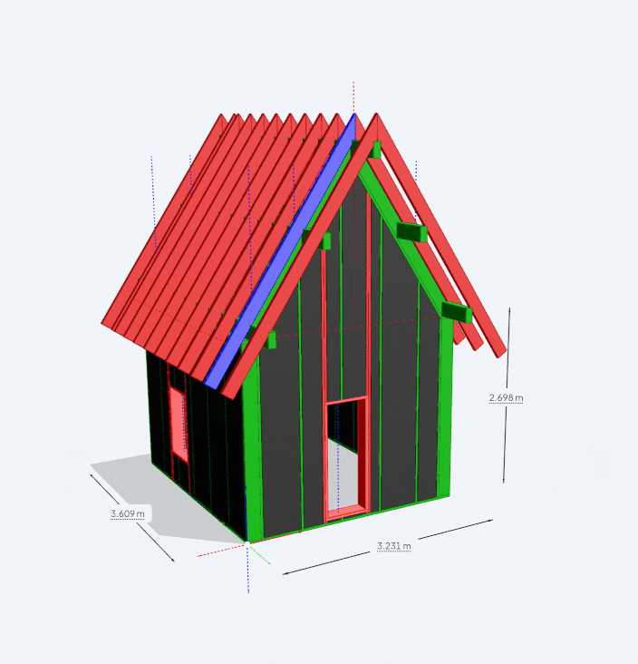
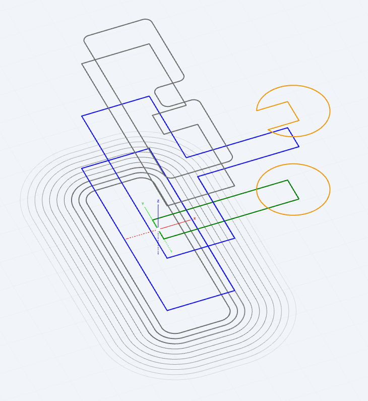
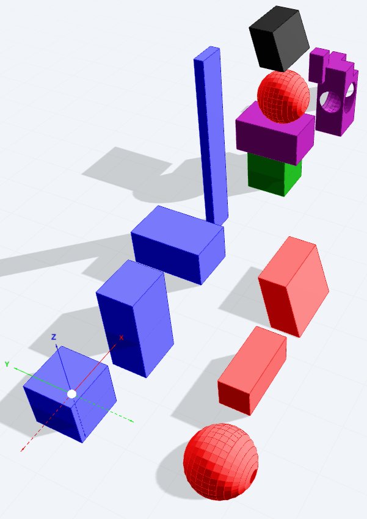

# Meshup (`@archiyou/meshup`)

[](https://github.com/ArchiyouApp/meshup/blob/main/LICENSE) [](https://github.com/ArchiyouApp/meshup/actions/workflows/ci.yml) [](https://www.npmjs.com/package/@archiyou/meshup)



A general-purpose 3D mesh/curve modeling library for TypeScript, powered by a Rust/WASM
kernel (a fork of [csgrs](https://github.com/timschmidt/csgrs), vendored in `rust/`, in process of rebasing). It combines CSG
(constructive solid geometry), quasi-CAD curve/sketch tooling, and mesh utilities behind a
fluent, chainable JS API — built as the modeling kernel for
[Archiyou](https://archiyou.com) Script CAD, but usable standalone in Node or the browser.


## Features

- **Shapes**: `Mesh` (solids: cube, sphere, cylinder, custom polygons/points, SDF) and
  `Curve` (2D/3D: lines, polylines, arcs, circles, ellipses/elliptical arcs, rectangles,
  interpolated splines, compounds) as first-class, chainable objects.
- **CSG booleans**: `union`, `difference`/`subtract`, `intersection`, `split` on meshes; exact 2D
  boolean ops on curves — arcs and lines are preserved rather than tessellated. Curve
  booleans require both curves to be closed and coplanar; a failure warns and returns
  `null` (there is no tessellated fallback).
- **Corner operations**: `fillet`/`chamfer` on every corner or only selected ones
  (`curve.fillet(5, 0)`, `curve.fillet(5, [10, 10, 0])`, `curve.fillet(5, 'vertex<<->[0,0,0]')`).
- **Edges & selection**: `mesh.edges()` returns deduplicated model edges grouped into
  `boundary` / `crease` / `flat`, and `mesh.select()` / `collection.select()` can query them
  (`'edge|z'`, `'edge<<->[0,0,0]'`).
- **Transforms & alignment**: move/rotate/mirror/scale, `alignByPoints`, `rotateSwing`,
  bounding boxes (`Bbox`, oriented `OBbox`), replication (`replicate`, `row`, grids).
- **Sketch & text**: 2D sketch primitives, TrueType and Hershey stroke-font text
  (`Sketch.textOutline/textSolid/textStroke`).
- **2D projection & drawings**: `ShapeCollection.isometry()`, `elevation()` and `section()`
  turn 3D models into line work, with switchable hidden-line removal (`'exact'` (default),
  `'raycast'`, `'clip'`, `'painter'`) — `isometry([-1,-1,1], 'exact', { hiddenLines: true })`.
- **Styling**: per-shape `Style` (color, opacity, stroke width/dash/cap/join, point
  markers, PBR materials) that flows through to exported geometry.
- **Scene graph**: `SceneNode` hierarchy with layers, named lookup (`find`/`findAll`),
  active-layer tracking, and cascading style.
- **Export**: glTF/GLB via `GLTFBuilder`/`SceneNode.toGLTF()`/`toGLB()`, including custom
  extensions for line style, point style, and edge visibility; SVG for 2D line work
  (`ShapeCollection.toSVG()`, `SceneNode.toSVG()`); STL via
  `Mesh.toSTLBinary()`/`toSTLAscii()`.
- **Import**: `Importer`/static `from*` factories for SVG, GeoJSON, DXF (2D curves), and
  OBJ, STL, glTF/GLB, AMF, 3MF (meshes) — auto-detected via `Importer.load()`.

## Installation

```bash
pnpm add @archiyou/meshup
# or: npm install @archiyou/meshup / yarn add @archiyou/meshup
```
## Usage

Meshup loads its WASM kernel asynchronously. Call `init()` once before using any shape
classes:

```ts
import { init, Mesh, Curve, Point } from '@archiyou/meshup';

await init();

const box = Mesh.Cube(10).moveTo([0, 0, 5]).color('blue');
const hole = Mesh.Cylinder(3, 20).moveTo([0, 0, 5]);

const result = box.difference(hole);

const glb = await result.toGLB(); // Uint8Array, ready to save or stream
```

### Node.js

```ts
import { init, Mesh } from '@archiyou/meshup';
import { writeFileSync } from 'node:fs';

await init();
const mesh = Mesh.Sphere(10);
writeFileSync('sphere.glb', await mesh.toGLB());
```

### Browser

```html
<script type="module">
  import { init, Mesh } from 'https://esm.sh/@archiyou/meshup';

  await init();
  const mesh = Mesh.Cylinder(5, 10).color('red');
  const glb = await mesh.toGLB(); // feed into three.js / Babylon.js GLTFLoader
</script>
```

A CDN like esm.sh serves the `.wasm` alongside the JS, so this streams the binary. Where it
can't be fetched, the embedded base64 takes over — either way there is no `.wasm` MIME type
or asset copying to configure.

## Examples

### Curves



```ts
import { initAsync, Curve } from '@archiyou/meshup';

// Load kernel
await initAsync();   

const r1 = Curve.Rect(100, 300)
    .color('blue')
    .strokeWidth(2);

const r2 = Curve.Rect(200, 40)
    .move(100)
    .color('green')
    .strokeWidth(2);

const r1f = r1.copy().moveZ(-50)
    .fillet(20)!
    .color('gray');

const offsets = r1f.copy().replicate(10,
    (r, i) =>
        r.offset(10 * i)!
            .alpha(1 - i * 0.1)
            .strokeWidth(2 - i * 0.2));

const r12u = (r1.copy().union(r2) as Curve).moveZ(100);
const r12s = (r1.copy().subtract(r2) as Curve)
              .moveZ(200).color('gray');
const r12sf = r12s.copy().fillet(10)!.moveZ(50);

const c = Curve.Circle(50).align(r2, 'center', 'right')
    .color('orange').strokeWidth(2);

const csub = (c.copy().subtract(r2) as Curve).moveZ(150);

// output
const all = new ShapeCollection(r1, r2, r1f, offsets,
           r12u, r12s, r12sf, c, csub);
const gltf = await all.toGLTF(); // or all.toSVG()
// write bytes to file or send to a viewer
```

### Meshes



```ts

import { initAsync, Mesh, 
      Polygon, ShapeCollection } 
  from '@archiyou/meshup';

await initAsync();

// boxes
const bx1 = Mesh.Box(50).color('blue');
const bx2 = Mesh.Box(50, 40, 100)
              .move(100).color('blue');
const bx3 = Mesh.BoxBetween(
                [170, 50, 0], [220, -30, 40])
              .color('blue');
const bx4 = Mesh.BoxBetween(
              [250, 0, 0], [280, 10, 200])
                .color('blue');

// others
const sph = Mesh.Sphere(30)
              .move(0, -150).color('red');
const pl = Polygon.planeBetween(
          [50, 0, 0], [120, 30, 0])
    .moveY(-150).color('red');
const extr = pl.copy().extrude(30).color('red');
const extr2 = pl.move(100)
              .extrude(50, [1, 1, 1]).color('red');

// aligning
const stack0 = bx1.copy().move(400)
    .color('green');
    
const stack1 = bx3.copy()
    // align to, pivot and place at other
    .align(stack0, 'centerbottom', 'centertop')   
    .color('purple');
const stack2 = sph.copy()
    .align(stack1, 'frontbottom', 'fronttop')
    .color('red');
const stack3 = extr2.copy()
    .align(stack2, 'frontleftbottom', 'top')
    .color('black');

// booleans
const boolbox = bx2.copy().moveTo(600)
    .subtract(sph.copy().moveTo(600)) as Mesh;

boolbox.subtract(
    Mesh.Box(40).align(
        boolbox.select('V||topfrontright'),
        'center',
        'center')
).union(
    Mesh.Box(20, 20, 40).align(
        boolbox.select('V||topbackleft'),
        'center',
        'center')
).color('purple');

// gather what you want out to export
const all = new ShapeCollection(bx1, bx2, bx3, 
              bx4, sph, extr, extr2,
              stack0, stack1, stack2, stack3, boolbox);
const glb = await all.toGLB();
// ===> do something with the bytes
```

### Manage your scene

```ts
import { init, Mesh, SceneNode } from '@archiyou/meshup';

await init();

const scene = SceneNode.root();
scene.addLayer('walls', Mesh.Cube(100));
scene.addLayer('roof', Mesh.Cylinder(50, 20).moveToZ(100));

const glb = await scene.toGLB();
```

## More examples

Check tests/examples.


### WASM hints

The core of Meshup works with a WASM file; This might complicate develop and deployment. Some notes:

**Automatic WASM finding and inline base64 fallback**. Meshup tries to find .wasm automatically. Most bundlers detect it and make it work for you. If it fails, the WASM is loaded from a internal base64 string. Because base64 (~8mb) encoding is bigger make sure you fix the WASM file (~6mb) before using in production.

**Manually point to WASM file** `init()` accepts anything wasm-bindgen does — a URL, a `Response`, raw bytes or a compiled `WebAssembly.Module`. Supplying one **disables the fallback**: a wrong source fails loudly
instead of quietly costing a 7.8 MB base64 download.

```ts
await init({ wasm: 'https://cdn.example.com/meshup_bg.wasm' }); // your own hosting
```

**For Vite users:** if you install meshup from npm (rather than linking it in a workspace),
Vite's dependency pre-bundling copies the module into `node_modules/.vite/deps/` and the
`.wasm` no longer sits beside it, so dev mode logs a 404 and falls back to base64. Builds
are unaffected. To keep the file path in dev too:

```ts
// vite.config.ts
export default { optimizeDeps: { exclude: ['@archiyou/meshup'] } };
```


## Known limitations

Things are the radar:

- `Polygon.offset()` and holes
- `ShapeCollection.offset()` only offsets `Curve`
- `Sketch.loft()` does not work
-  no PLY import yet
- `Mesh.edges()` classifies an edge by the angle between adjacent face normals, so a
  smooth-shaded curved surface (sphere, cylinder wall) yields many near-coplanar edges.
  Raise `featureAngle` to thin them out.

## Development

The Rust kernel lives in `rust/` (a fork of csgrs). It pulls in five git submodules —
`rust/hypercurve`, `rust/hyperreal`, `rust/hypersolve`, `rust/hyperlattice`,
`rust/hyperlimit`. `hypercurve` is a path dependency of the `rust/` crate; the other four
are wired up by the root `Cargo.toml` via `[patch.crates-io]`. Either way a non-recursive
clone cannot build the WASM.

Both generated artifacts (`src/wasm/` and the base64 blob `src/meshup-js-binary.ts`) are
committed, so **you only need the Rust toolchain if you change Rust code**.

```bash
# clone including the Rust submodules
git clone --recursive https://github.com/ArchiyouApp/meshup
# (already cloned? git submodule update --init --recursive)

# install JS/TS dependencies
pnpm install

# Rust toolchain, for building the WASM kernel: https://rustup.rs/
cargo install wasm-pack

# quick Rust sanity check
pnpm rust:check
# build the WASM kernel + regenerate the embedded base64 binary
pnpm build:wasm

# build the TS package
pnpm build

# run tests
pnpm test        # watch mode
pnpm test:run    # single run

# type-check
pnpm lint

# release gates (also run in CI)
pnpm check:wasm-integrity   # base64 blob matches src/wasm/meshup_bg.wasm
pnpm check:pack             # the tarball contains exactly what it should
```

Never hand-roll `wasm-pack`/`cargo build` invocations for the WASM output — always use
`pnpm build:wasm` (see `AGENTS.md`), so the generated bindings and embedded binary stay in
sync with the TS side. That script also strips wasm-pack scaffolding that would otherwise
break the published package, so bypassing it will produce a broken tarball.

## License

Apache-2.0 — see [LICENSE](./LICENSE).

The Rust kernel this package compiles to WebAssembly is a fork of
[csgrs](https://github.com/timschmidt/csgrs) (MIT, © Timothy Schmidt, deriving from csg.js
© Evan Wallace). That MIT-licensed code is part of the published bundle, so its notice
travels with this package: see [NOTICE](./NOTICE) and
[THIRD-PARTY-NOTICES.txt](./THIRD-PARTY-NOTICES.txt).
